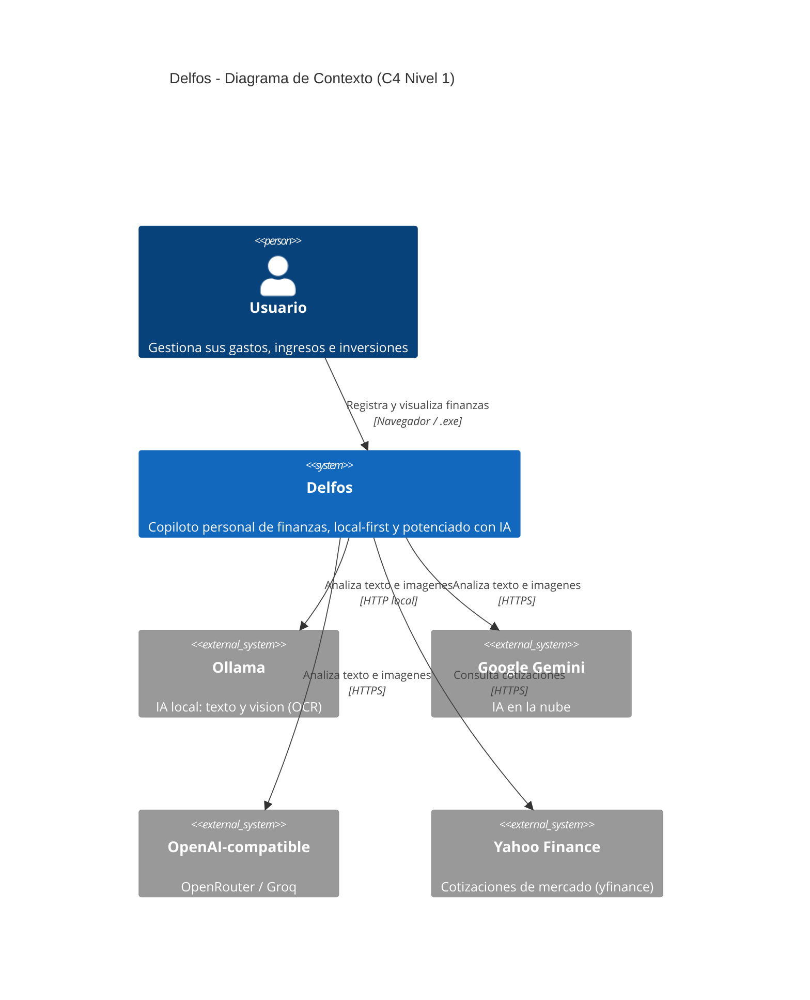
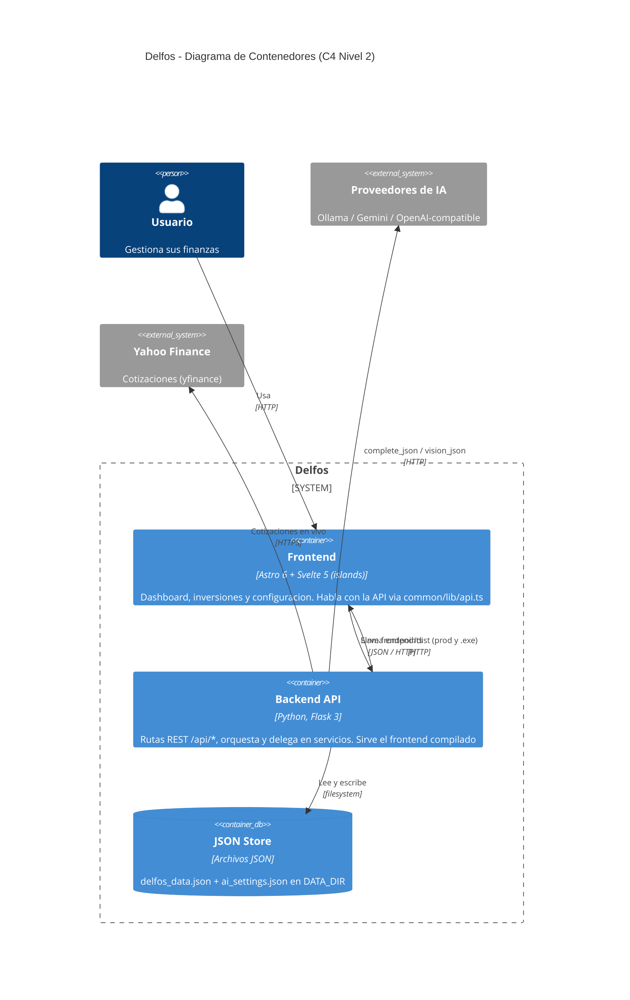
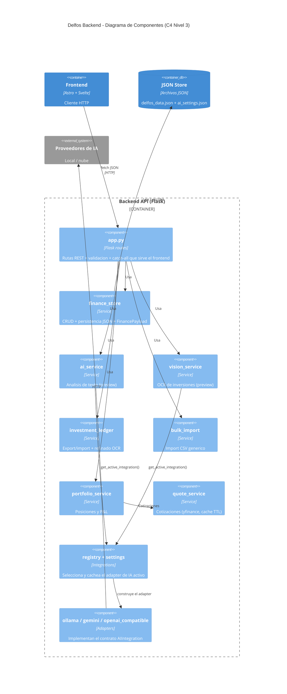
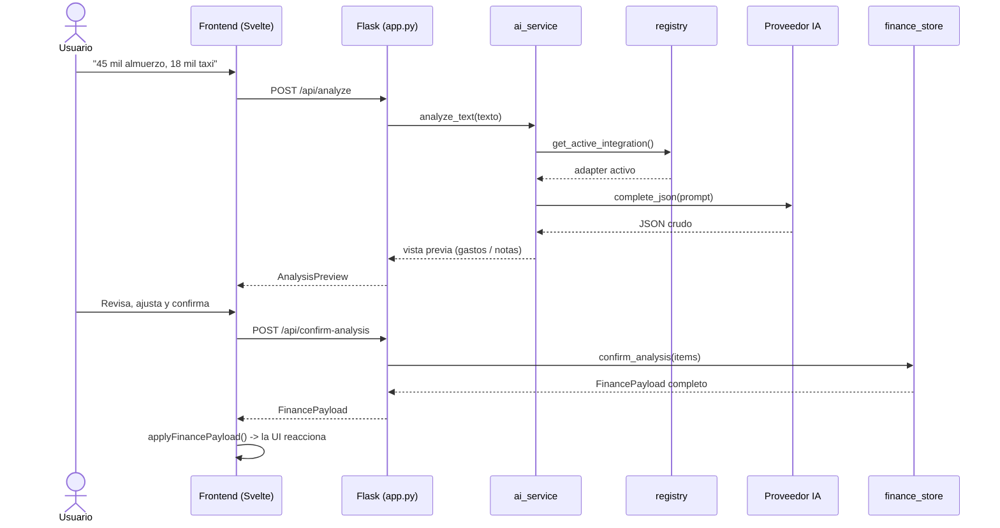

<div align="center">

# 🜲 Delfos

### Copiloto personal de finanzas — gastos, ingresos e inversiones, potenciado con IA

Registra por **texto, voz, CSV o foto**, visualiza al instante y deja que la IA haga el trabajo aburrido.
**Local-first**: tus datos viven en archivos tuyos, la IA es opcional.

`Flask` · `Astro + Svelte` · `Ollama / Gemini / OpenAI-compatible` · `Local-first` · `Windows .exe` · `Electron (PoC Linux/Mac)`

</div>

---

## ✨ Qué hace

- 📊 **Dashboard de finanzas** — cuentas, gastos, ingresos, inversiones, notas y categorías en una sola vista, con resumen del mes, saldos por cuenta y movimientos recientes.
- 🎙️ **Captura sin fricción** — registro manual, por **voz** (dictado), por **análisis de texto con IA** ("45 mil en almuerzo y 18 mil en taxi") e **importación masiva CSV**.
- 🤖 **IA que propone, tú confirmas** — la IA estructura tus movimientos en una **vista previa**; nada se guarda sin tu confirmación.
- 📈 **Inversiones** — un **ledger** de 10 columnas con export **CSV/XLSX**, import **CSV**, **OCR** de capturas de broker y un **portafolio** con valor de mercado y P&L (cotizaciones en vivo).
- 🔌 **IA intercambiable** — proveedor **local** (Ollama) o **nube** (Gemini / OpenRouter / Groq), seleccionable desde Configuración. Tu API key nunca sale del backend.
- 🖥️ **App de escritorio** — un `.exe` portátil de Windows que sirve frontend + API en un solo proceso, sin Docker ni Node.

> El registro manual y la importación **funcionan sin IA**. La IA es un acelerador, no un requisito.

---

## 🗺️ Arquitectura (modelo C4)

> Delfos usa una arquitectura deliberadamente simple: **Flask por servicios** + **Astro/Svelte por features**. Sin Clean Architecture, sin IoC, sin ORM. La fuente de verdad detallada está en [`docs/01_arquitectura.md`](docs/01_arquitectura.md).

### Nivel 1 — Contexto del sistema

Quién usa Delfos y con qué sistemas externos habla.



### Nivel 2 — Contenedores

Las piezas ejecutables y dónde viven los datos.



### Nivel 3 — Componentes del backend

Cómo se reparte el trabajo dentro de la API Flask.



---

## 🔄 Flujo de IA (analizar → confirmar)

El patrón clave de Delfos: **la IA nunca persiste sin confirmación.**



> Si no hay IA configurada o el JSON falla, el texto se guarda como **nota** (fallback). El mismo patrón previo→confirmación aplica al **OCR** de inversiones, partiendo de una imagen.

---

## 🧰 Stack tecnológico

| Capa | Tecnología |
|------|------------|
| Frontend | Astro 6 · Svelte 5 (islands) · TypeScript · Vite |
| Backend | Python ≥ 3.10 · Flask 3 · flask-cors · gestionado con `uv` |
| Persistencia | Archivos JSON locales (sin base de datos) |
| IA — local | Ollama (texto + visión) |
| IA — nube | Google Gemini · OpenAI-compatible (OpenRouter, Groq) |
| Cotizaciones | yfinance (Yahoo Finance) con cache TTL en memoria |
| Empaquetado | PyInstaller + waitress → `.exe` de Windows |
| Docker | nginx (frontend) + Flask (API), mismo origen sin CORS |

---

## 📁 Estructura del proyecto

```
delfos/
├── backend/                 # API Flask (Python)
│   ├── app.py               # Rutas REST + catch-all que sirve frontend/dist
│   ├── config.py            # .env, DATA_DIR, FRONTEND_DIR, OLLAMA_*, FLASK_*
│   ├── services/            # Lógica de negocio + persistencia JSON
│   │   ├── finance_store.py     # núcleo de datos + payload
│   │   ├── ai_service.py        # análisis de texto (preview)
│   │   ├── vision_service.py    # OCR de inversiones (preview)
│   │   ├── investment_ledger.py # export/import + refinado OCR
│   │   ├── bulk_import.py       # import CSV genérico
│   │   ├── portfolio_service.py # posiciones y P&L
│   │   └── quote_service.py     # cotizaciones (yfinance)
│   ├── integrations/        # Proveedores de IA intercambiables
│   │   ├── base.py              # AIIntegration + IntegrationError
│   │   ├── settings.py          # config + secretos (api_key)
│   │   ├── registry.py          # selección + cache del adapter activo
│   │   ├── ollama.py            # adapter local
│   │   ├── gemini.py            # adapter nube
│   │   └── openai_compatible.py # adapter nube (OpenRouter / Groq)
│   ├── data/                # JSON store (gitignored)
│   └── tests/               # unittest
├── frontend/                # Astro + Svelte
│   └── src/
│       ├── pages/           # index · inversiones · configuracion (.astro)
│       ├── features/        # dashboard · inversiones · settings
│       └── common/          # atoms/molecules/organisms · lib/api.ts · stores · styles
├── desktop/                 # Shell desktop Electron (PoC)
│   ├── main.js              # Arranca Flask local + crea ventana nativa
│   └── package.json         # Scripts y dependencias de Electron
├── docs/                    # Fuente de verdad (visión + arquitectura)
├── AGENTS.md                # Instrucciones Cloud Agents (environment + comandos)
├── .cursor/                 # Reglas, skills y environment.json (Cloud Agents)
│   ├── environment.json     # Dockerfile + install para agentes
│   ├── Dockerfile           # Node 22 + uv + deps Electron/AppImage
│   └── install.sh           # Sync idempotente frontend/desktop/backend
├── agentic-framework/       # Método de trabajo agéntico (portable)
├── legacy/                  # Plantillas Jinja originales (referencia)
└── docker-compose.yml
```

---

## 🚀 Cómo empezar

> **Requisitos para IA local/OCR:** [Ollama](https://ollama.com) corriendo en el host con un modelo de texto y uno de **visión** (para OCR). La IA en la nube no requiere Ollama.

### Opción A — Desarrollo local (Windows / PowerShell)

**Terminal 1 — API**

```powershell
cd backend
$env:OLLAMA_URL="http://127.0.0.1:11434"
$env:OLLAMA_MODEL="llama3.2"
$env:OLLAMA_VISION_MODEL="llava"   # ollama pull llava (requerido para OCR local)
uv sync
uv run python app.py
```

API en http://127.0.0.1:5000 → responde `{"service":"delfos-api"}`.

**Terminal 2 — UI**

```powershell
cd frontend
npm install
npm run dev
```

App en http://localhost:4321 (e inversiones en http://localhost:4321/inversiones).
Define `PUBLIC_API_BASE_URL=http://localhost:5000` en `frontend/.env`.

### Opción B — Docker (stack completo)

```powershell
# Instala un modelo de visión en el Ollama del host (requerido para OCR)
ollama pull llava        # alternativa ligera: ollama pull moondream

docker compose up --build
```

- App: **http://localhost:8080** · Inversiones: **http://localhost:8080/inversiones**
- API proxeada en `/api/*` (mismo origen, sin CORS) · Datos en `./backend/data`
- Ollama visible en `http://host.docker.internal:11434` desde el contenedor.

### Opción C — App de escritorio (`.exe` portátil)

```powershell
powershell -ExecutionPolicy Bypass -File .\build_exe.ps1
```

- Resultado: `backend\dist\Delfos.exe` (~38 MB). Doble clic → arranca en `http://localhost:5000` y abre el navegador.
- Datos persistentes en `%LOCALAPPDATA%\Delfos\data` (sobreviven a cierres y reinstalaciones).
- Para IA sin instalar Ollama, configura un proveedor en la nube (Gemini / OpenRouter) desde **Configuración**. El registro manual funciona sin IA.
- El `.exe` es específico de Windows; para Mac/Linux hay que compilar en cada SO.

### Opción D — App de escritorio con Electron (Linux/Mac)

```bash
npm --prefix frontend install
npm --prefix frontend run build
cd backend && uv sync && cd ..
npm --prefix desktop install
npm --prefix desktop run dev
```

- Electron arranca Flask como proceso hijo local y abre la app en una ventana nativa.
- Los datos se guardan en la carpeta `userData` del sistema operativo (`.../Delfos/data`).
- Empaquetado: `npm --prefix desktop run dist:linux` (AppImage) o `dist:mac` (DMG, desde macOS).
- Variables opcionales: `DELFOS_BACKEND_CMD`, `DELFOS_BACKEND_TIMEOUT_MS`, `DELFOS_RENDERER_URL`.
- Más detalles: `desktop/README.md`.

---

## 🤖 Configurar la IA

Desde la pantalla **Configuración** (o `POST /api/settings/ai`) eliges el proveedor:

| Proveedor | `provider` | Notas |
|-----------|-----------|-------|
| Ollama (local) | `local` | Requiere Ollama corriendo; OCR exige modelo de visión (`llava`, `moondream`) |
| Google Gemini | `gemini` | Requiere tu API key |
| OpenAI-compatible | `compatible` | OpenRouter / Groq; requiere `base_url` + API key |

- Si `cloud_enabled = false`, el proveedor efectivo es **siempre `local`**.
- La **API key vive solo en el backend**; al cliente se le entrega enmascarada (`masked_key`).
- Salud y prueba de conexión: `GET /api/ai/health` y `POST /api/settings/ai/test`.

---

## 🔗 API (resumen)

Base: `/api`. Las rutas mutadoras devuelven el `FinancePayload` completo para que la UI se refresque en una sola respuesta.

| Método | Ruta | Acción |
|--------|------|--------|
| `GET` | `/api/finance` | Estado completo de finanzas |
| `GET` | `/api/charts` | Datos para gráficos |
| `POST·PATCH·DELETE` | `/api/{accounts,expenses,incomes,investments,notes,categories}` | CRUD |
| `POST` | `/api/analyze` · `/api/confirm-analysis` | Análisis IA (preview → confirm) |
| `POST` | `/api/investments/ocr` · `/api/investments/ocr/confirm` | OCR de inversiones |
| `GET` | `/api/investments/export.csv` · `export.xlsx` | Export del ledger |
| `POST` | `/api/{investments,expenses,incomes,notes,accounts}/import.csv` | Import CSV |
| `GET` | `/api/investments/portfolio` | Posiciones y P&L |
| `GET·POST` | `/api/settings/ai` · `/api/settings/ai/test` | Config de IA |
| `GET` | `/api/ai/health` · `/api/ollama/health` | Health checks |

> Lista completa y mapeo a servicios en [`docs/01_arquitectura.md`](docs/01_arquitectura.md).

---

## 🧪 Tests

```powershell
cd backend
uv sync
uv run python -m unittest tests.test_api -v
```

---

## 📚 Documentación

- [`docs/00_vision.md`](docs/00_vision.md) — Visión de producto: problema, usuarios, alcance, reglas de negocio y glosario.
- [`docs/01_arquitectura.md`](docs/01_arquitectura.md) — Arquitectura real: capas, carpetas, flujos de datos, patrón de IA y reglas para agentes.
- [`agentic-framework/`](agentic-framework/README.md) — Método de trabajo con agentes (skills, estructura y flujo), portable a otros proyectos.

---

<div align="center">

Hecho con foco en lo simple que funciona. **Tus finanzas, tus datos, tu copiloto.**

</div>
